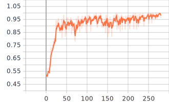
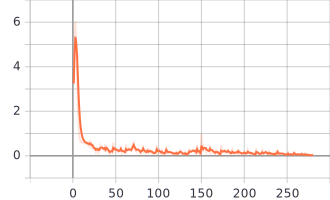
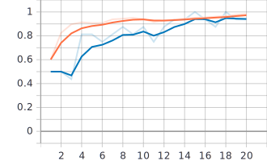
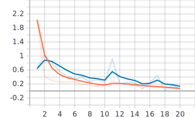

# pneumonia-CNN
Scanning chest x-rays for pneumonia using a deep convolutional network

## Training results
Accuracy vs Batch

Loss vs Batch

Accuracy vs Epoch

Loss vs Epoch

0.9375 final validation accuracy

0.9828 final trainging accuracy

## Data
The dataset can be found [here](https://data.mendeley.com/datasets/rscbjbr9sj/2)

-- Kermany, Daniel; Zhang, Kang; Goldbaum, Michael (2018), “Labeled Optical Coherence Tomography (OCT) and Chest X-Ray Images for Classification”, Mendeley Data, v2
http://dx.doi.org/10.17632/rscbjbr9sj.2

CC BY 4.0