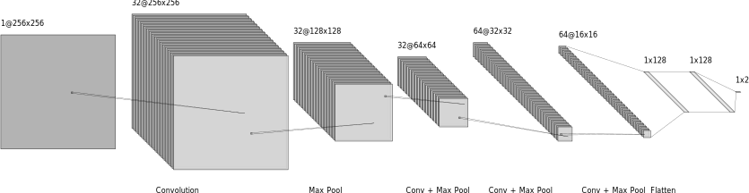

# pneumonia-CNN
Scanning chest x-rays for pneumonia using a deep convolutional network

## Example

  
  

A healthy and diseased x-ray next to each other.

## Training results
Accuracy vs Batch & Loss vs Batch

  
  

Accuracy vs Epoch & Loss vs Epoch

  
  

0.9375 final validation accuracy

0.9828 final training accuracy

## Architecture

| Layer Type      | Activation | Parameters               |
|-----------------|------------|--------------------------|
| Conv 2D         | RelU       | 3x3 kernel 32 filters |
| Max Pool 2D     | None       | 2x2 stride               |
| Conv 2D         | RelU       | 3x3 kernel 32 filters |
| Max Pool 2D     | None       | 2x2 stride               |
| Conv 2D         | RelU       | 3x3 kernel 64 filters |
| Max Pool 2D     | None       | 2x2 stride               |
| Conv 2D         | RelU       | 3x3 kernel 64 filters |
| Max Pool 2D     | None       | 2x2 stride               |
| Flatten         | None       | None                     |
| Fully Connected | RelU       | 128 units                |
| Dropout         | None       | 0.5 rate                 |
| Fully Connected | RelU       | 128 units                |
| Dropout         | None       | 0.5 rate                 |
| Fully Connected | Softmax    | 2 units                  |

## Data
The dataset can be found [here](https://data.mendeley.com/datasets/rscbjbr9sj/2)

-- Kermany, Daniel; Zhang, Kang; Goldbaum, Michael (2018), “Labeled Optical Coherence Tomography (OCT) and Chest X-Ray Images for Classification”, Mendeley Data, v2
http://dx.doi.org/10.17632/rscbjbr9sj.2

CC BY 4.0